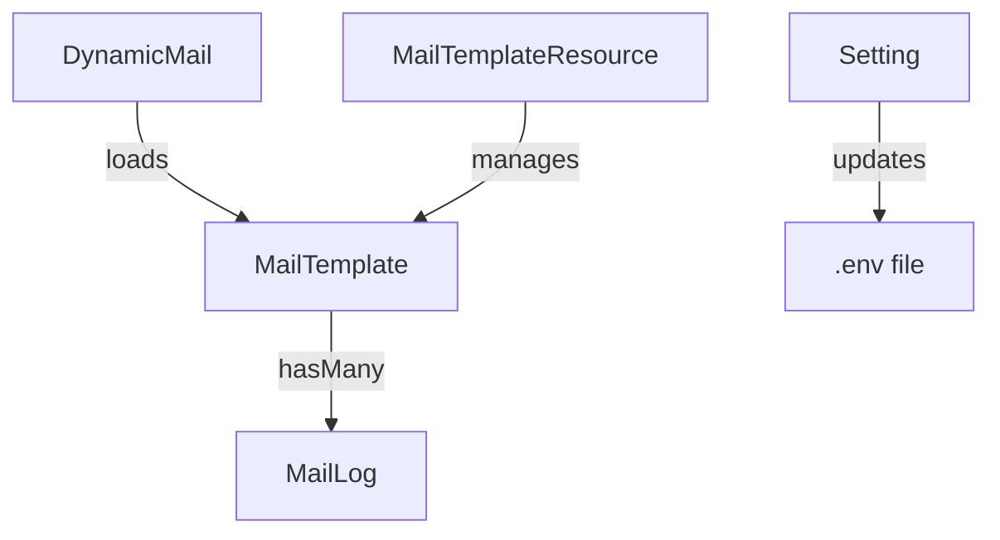
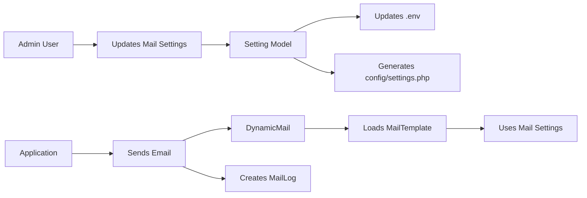
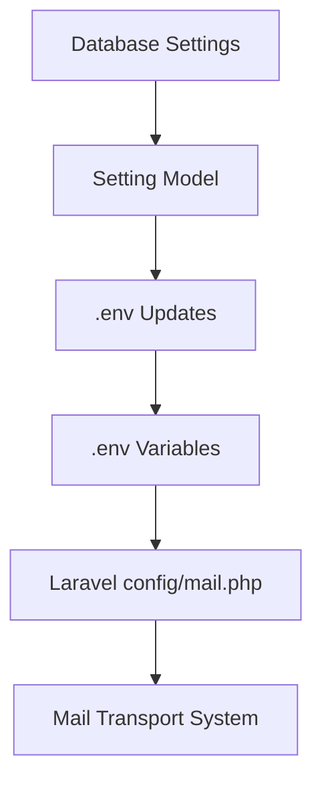

# System Map: Mail System

## Overview

This document provides a visual and structural map of the mail system components and their relationships.

## Directory Structure

```
app/
├── Mail/
│   ├── DynamicMail.php          # Dynamic email mailable class
│   └── WelcomeEmail.php         # Static email example
├── Models/
│   ├── MailTemplate.php         # Mail template model
│   ├── MailLog.php              # Mail log model
│   └── Setting.php              # Settings model (handles mail config)
├── Observers/
│   ├── MailTemplateObserver.php # Mail template model observer
│   └── MailTemplate.php         # Observer registration
├── Filament/
│   └── Resources/
│       └── MailTemplates/       # Admin interface for mail templates
│           ├── MailTemplateResource.php
│           ├── Pages/
│           │   ├── CreateMailTemplate.php
│           │   ├── EditMailTemplate.php
│           │   ├── ListMailTemplates.php
│           │   └── ViewMailTemplate.php
│           ├── Schemas/
│           │   ├── MailTemplateForm.php
│           │   └── MailTemplateInfolist.php
│           └── Tables/
│               └── MailTemplatesTable.php
├── Providers/
│   └── AppServiceProvider.php   # Application service provider
config/
├── mail.php                     # Laravel mail configuration
├── settings.php                 # Application settings configuration
├── app-settings.php             # Settings form configuration
database/
├── migrations/
│   ├── 2025_11_27_145405_create_mail_templates_table.php
│   └── 2025_11_27_145826_create_mail_logs_table.php
resources/
├── views/
│   └── emails/
│       ├── welcome.blade.php    # Static email template
│       └── {locale}/            # Dynamic email templates by locale
│           └── {blade_file}.blade.php
docs/
└── reference/
    ├── mail-system-overview.md  # General user documentation
    ├── mail-system-technical.md # Developer technical documentation
    └── system-map.md            # This file
```

## Component Relationships

### Model Relationships



### Data Flow



## Key Integration Points

### 1. Mail Template Creation

-   **Entry Point**: Filament Admin Panel
-   **Form Definition**: `MailTemplateForm.php`
-   **Storage**: `mail_templates` database table
-   **Model**: `MailTemplate.php`
-   **Observer**: `MailTemplateObserver.php`

### 2. Email Sending

-   **Entry Point**: Application code calling `Mail::send()`
-   **Mailable**: `DynamicMail.php`
-   **Template Loading**: Query `mail_templates` by code
-   **Content Rendering**: Blade templates in `resources/views/emails/`
-   **Configuration**: Laravel mail system using environment variables

### 3. Mail Logging

-   **Trigger**: Email sending process
-   **Storage**: `mail_logs` database table
-   **Relationship**: Links to `mail_templates` table
-   **Model**: `MailLog.php`

### 4. Settings Management

-   **Entry Point**: Settings page in admin panel
-   **Storage**: `settings` database table
-   **Processing**: `Setting.php` model
-   **Environment Sync**: `updateEnvironmentVariables()` method
-   **Configuration Reload**: Clears config cache

## Configuration Hierarchy



## File Dependencies

### DynamicMail.php

-   Depends on: `MailTemplate` model
-   Uses: `config('mail.from.name')` for default sender name
-   Requires: Blade template files in `resources/views/emails/`

### MailTemplate.php

-   Uses: `HasTranslations` trait for multi-language support
-   Uses: `MailTemplateObserver` for model events
-   Related to: `MailLog` model

### Setting.php

-   Uses: File facade for reading/writing files
-   Uses: Artisan facade for clearing config cache
-   Related to: `config/settings.php` file
-   Affects: `.env` file

### MailTemplateResource.php

-   Uses: Various schema components from `Schemas/` directory
-   Uses: Table configuration from `Tables/` directory
-   Manages: `MailTemplate` model

## Environment Variables Used

-   `MAIL_MAILER`: Default mail transport
-   `MAIL_HOST`: SMTP server address
-   `MAIL_PORT`: SMTP server port
-   `MAIL_USERNAME`: SMTP authentication username
-   `MAIL_PASSWORD`: SMTP authentication password
-   `MAIL_FROM_ADDRESS`: Default sender email address
-   `APP_NAME`: Application name (used as default sender name)

## Database Tables

### mail_templates

-   Primary key: `id`
-   Unique constraint: `code`
-   Foreign key relationships: None
-   Indexes: `code`, `is_active`

### mail_logs

-   Primary key: `id`
-   Foreign key: `mail_template_id` references `mail_templates.id`
-   Indexes: `mail_template_id`, `recipient`, `status`, `sent_at`

### settings

-   Primary key: `id`
-   Indexes: `key`
-   Stores mail configuration in `mail` group

## API Endpoints

-   **Filament Resources**: `/admin/mail-templates*`
-   **Database**: Direct Eloquent model access
-   **Mail Sending**: Laravel's `Mail` facade

## Extension Points

1. **Additional Mail Transports**: Extend `config/mail.php` with new mailers
2. **Custom Template Fields**: Modify migration and model for `mail_templates`
3. **Enhanced Logging**: Extend `MailLog` model and logging logic
4. **Advanced Settings**: Add more fields to settings configuration
